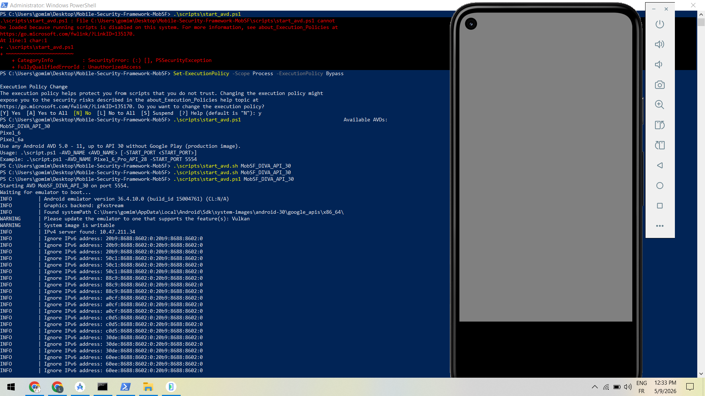
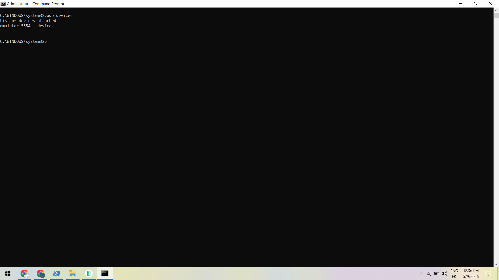
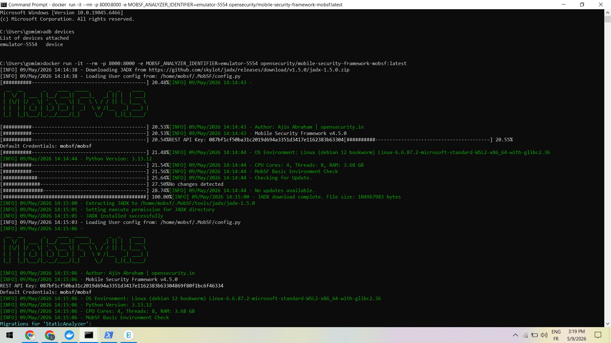
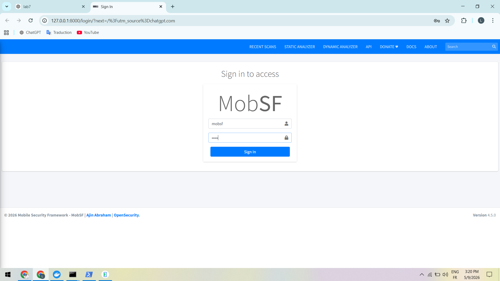
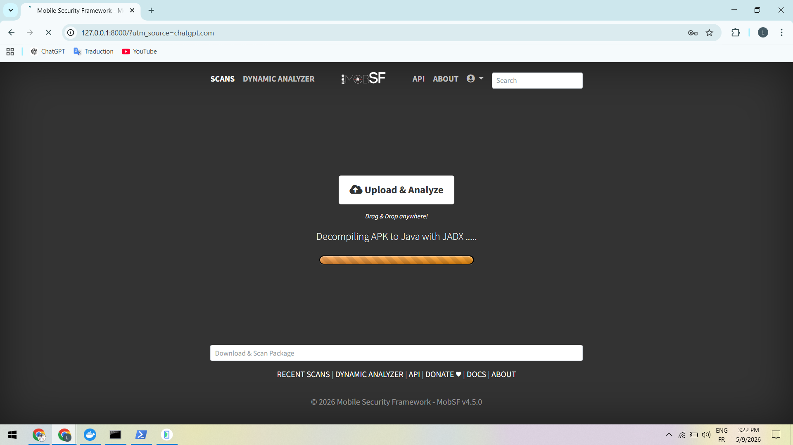
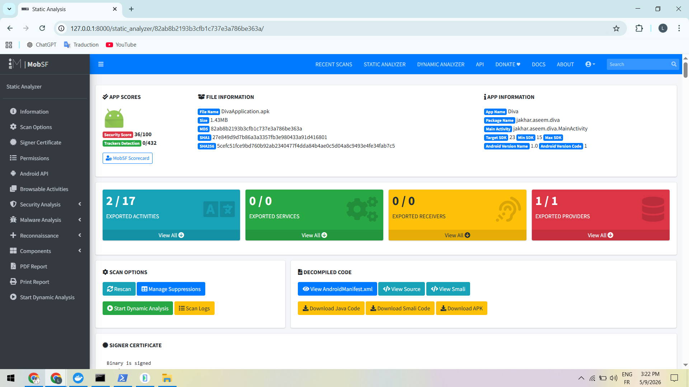
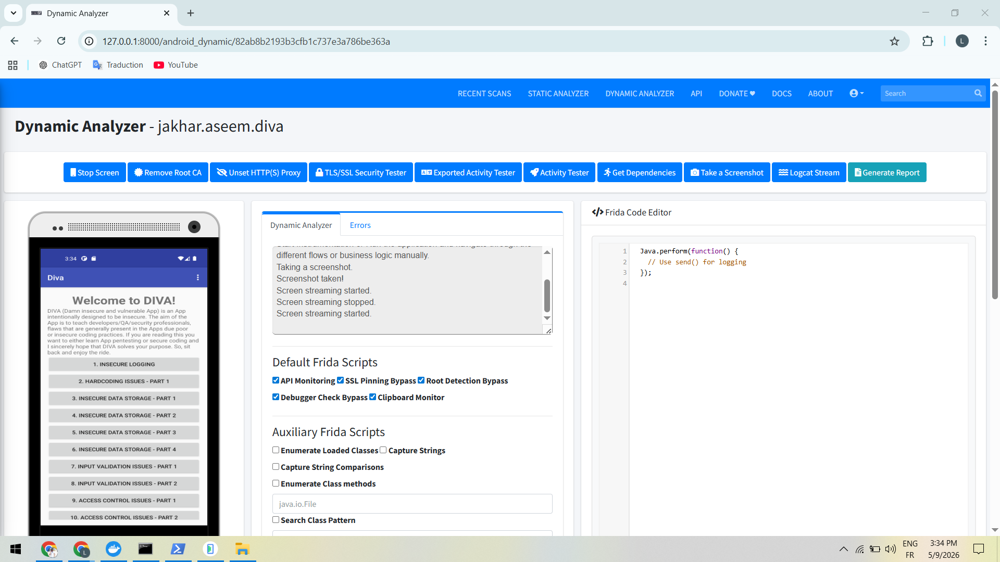
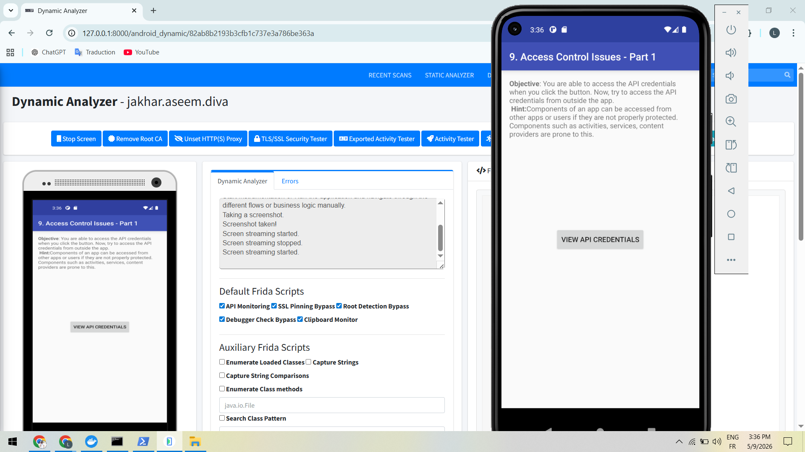

# Mobile Security Lab — Analyse Statique et Dynamique avec MobSF & DIVA

## Objectif du Lab

Ce laboratoire a pour objectif de :

* Configurer MobSF avec Docker
* Démarrer un émulateur Android rooté
* Réaliser une analyse statique d’une application Android
* Réaliser une analyse dynamique avec Frida
* Étudier les vulnérabilités de l’application DIVA
* Observer les problèmes de sécurité mobiles courants

---

# Environnement utilisé

| Outil            | Description                            |
| ---------------- | -------------------------------------- |
| MobSF            | Framework d’analyse de sécurité mobile |
| Docker           | Exécution de MobSF                     |
| Android Emulator | Émulateur Android API 30               |
| ADB              | Android Debug Bridge                   |
| DIVA             | Damn Insecure and Vulnerable App       |
| Frida            | Instrumentation dynamique              |

---

# Étape 1 — Démarrage de l’émulateur Android

Le script MobSF permet de lancer automatiquement un AVD Android rooté pour les analyses dynamiques.

## Commande utilisée

```powershell
.\scripts\start_avd.ps1 MobSF_DIVA_API_30
```

## Résultat obtenu

L’émulateur Android démarre correctement avec Android API 30.



---

# Étape 2 — Vérification de la connexion ADB

ADB permet de vérifier que l’émulateur Android est correctement détecté.

## Commande utilisée

```bash
adb devices
```

## Résultat obtenu

L’émulateur `emulator-5554` apparaît dans la liste des périphériques connectés.



---

# Étape 3 — Lancement de MobSF avec Docker

MobSF est lancé dans un conteneur Docker avec l’identifiant de l’émulateur Android.

## Commande utilisée

```bash
docker run -it --rm -p 8000:8000 -e MOBSF_ANALYZER_IDENTIFIER=emulator-5554 opensecurity/mobile-security-framework-mobsf:latest
```

## Résultat obtenu

MobSF initialise automatiquement :

* JADX
* Frida
* Dynamic Analyzer
* Configuration Android
* Analyse statique



---

# Étape 4 — Authentification sur MobSF

Connexion à l’interface web MobSF.

## Identifiants utilisés

```text
Utilisateur : mobsf
Mot de passe : mobsf
```

## Résultat obtenu

L’authentification fonctionne correctement.



---

# Étape 5 — Décompilation de l’APK avec JADX

MobSF commence automatiquement la décompilation de l’application Android afin d’obtenir le code Java.

## Résultat obtenu

Le processus de décompilation est exécuté correctement.



---

# Étape 6 — Analyse Statique de DIVA

L’application DIVA est analysée statiquement afin d’identifier les vulnérabilités Android.

## Informations détectées

| Élément        | Valeur            |
| -------------- | ----------------- |
| Application    | Diva              |
| Package        | jakhar.aseem.diva |
| Security Score | 36/100            |
| SDK cible      | 23                |

## Vulnérabilités détectées

* Activités exportées
* Content Provider exporté
* Mauvais contrôle d’accès
* Risques de stockage non sécurisé



---

# Étape 7 — Dynamic Analyzer

Le Dynamic Analyzer est utilisé pour analyser l’application pendant son exécution.

## Fonctionnalités activées

* SSL Pinning Bypass
* Root Detection Bypass
* API Monitoring
* Clipboard Monitoring
* Runtime Logs

## Résultat obtenu

MobSF prépare l’environnement dynamique avec Frida.



---

# Étape 8 — Analyse du challenge Insecure Data Storage

Le challenge « Insecure Data Storage » permet d’étudier les mauvaises pratiques de stockage des données sensibles.

## Objectif

Identifier :

* stockage en clair
* données non chiffrées
* permissions faibles
* accès non sécurisé aux fichiers

## Résultat obtenu

L’application demande des identifiants qui peuvent être stockés de manière non sécurisée dans le système Android.


---

# Étape 9 — Analyse du challenge Access Control Issues

Le challenge « Access Control Issues » permet d’étudier les problèmes de contrôle d’accès Android.

## Objectif

Tester :

* activités exportées
* accès non autorisés
* composants Android vulnérables
* exposition d’informations sensibles

## Résultat obtenu

L’application expose des composants Android accessibles sans protection suffisante.



---

# Conclusion

Ce laboratoire a permis de :

* Configurer un environnement d’analyse mobile complet
* Utiliser Docker avec MobSF
* Réaliser une analyse statique Android
* Réaliser une analyse dynamique Android
* Utiliser Frida pour l’instrumentation dynamique
* Étudier plusieurs vulnérabilités Android classiques

Les principales vulnérabilités observées concernent :

* stockage non sécurisé des données
* activités exportées
* problèmes de contrôle d’accès
* absence de protection des composants Android

---

# Compétences acquises

* Utilisation de MobSF
* Analyse APK Android
* Analyse dynamique Android
* Utilisation de Docker
* Utilisation d’ADB
* Surveillance runtime Android
* Introduction à Frida
* Étude des vulnérabilités mobiles
